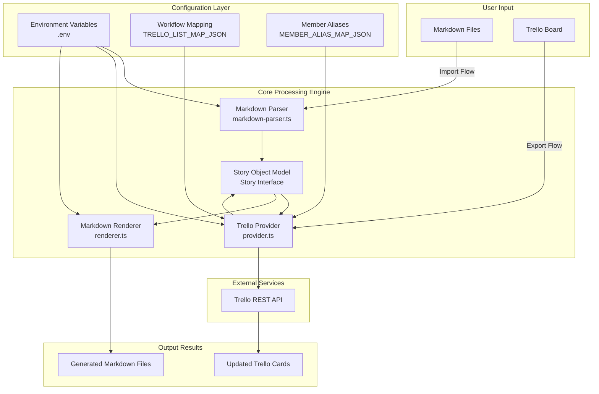
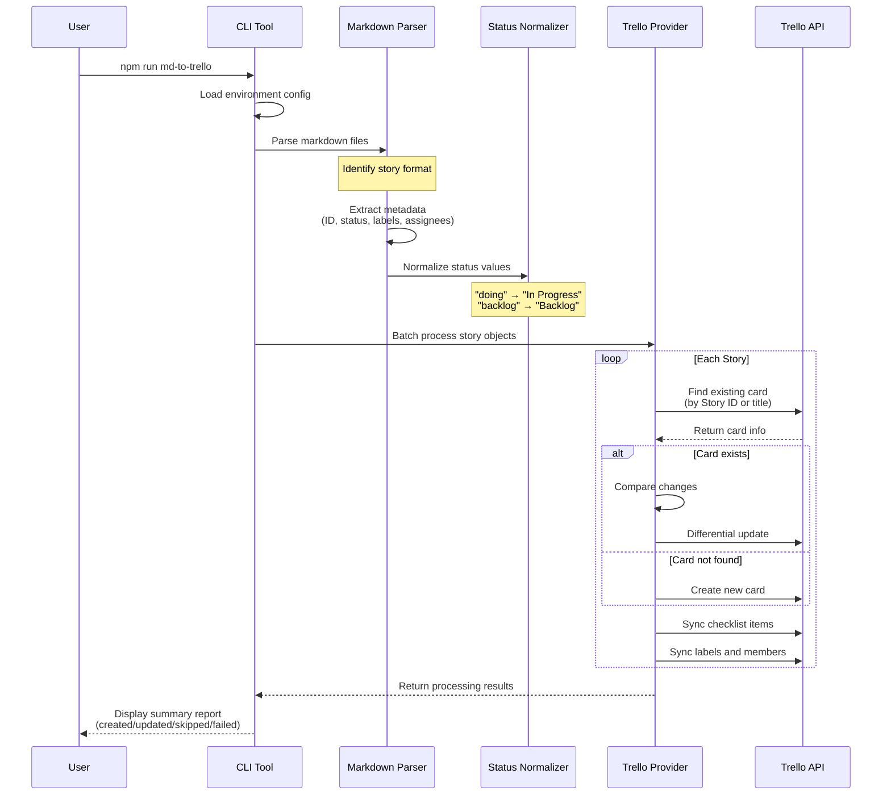
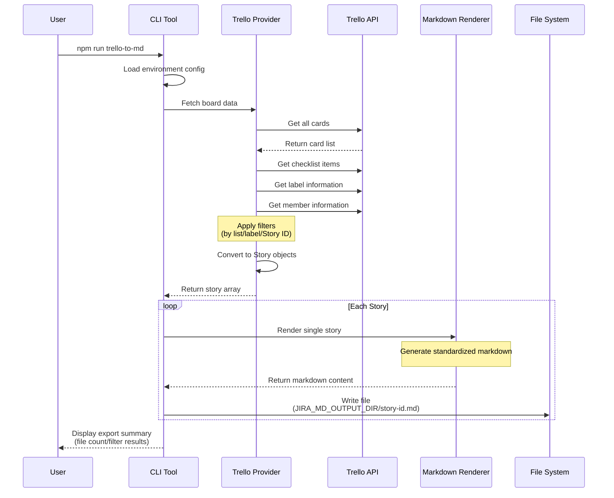
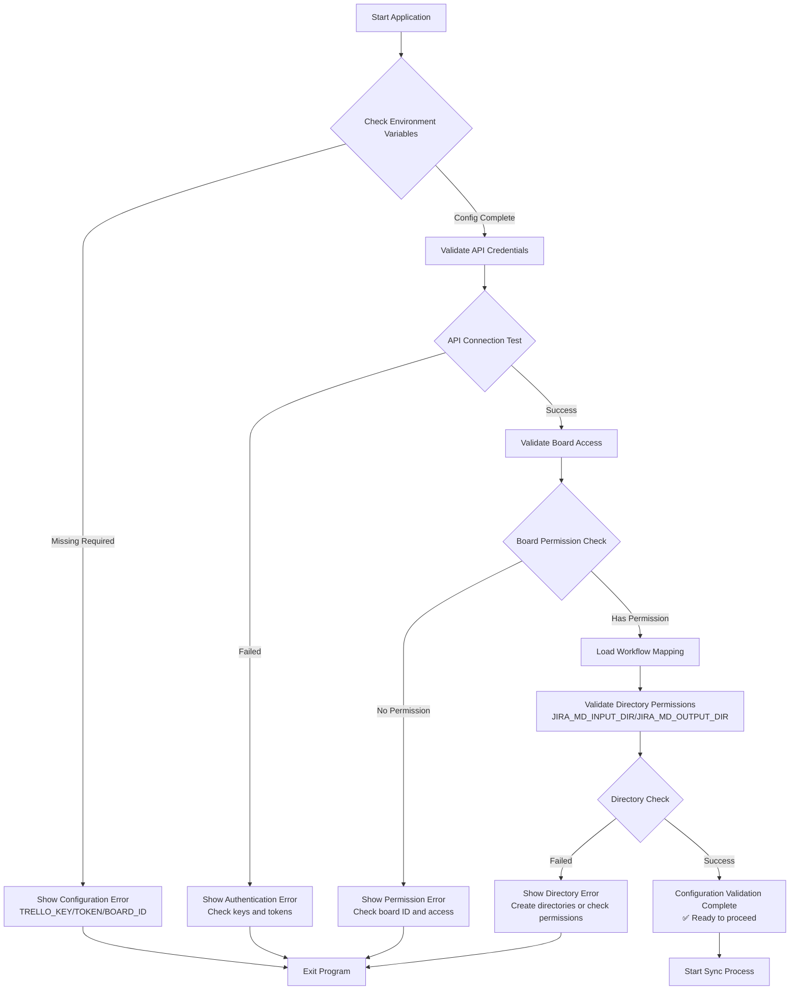
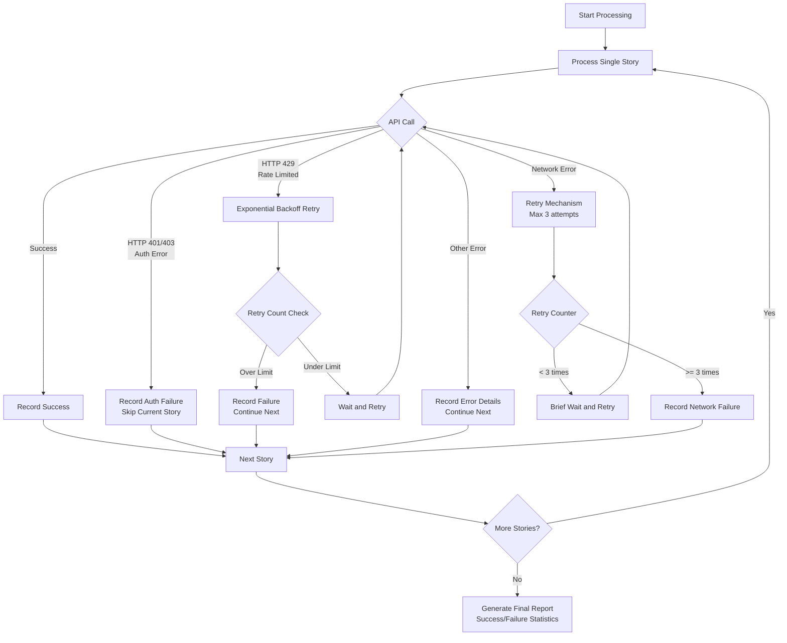
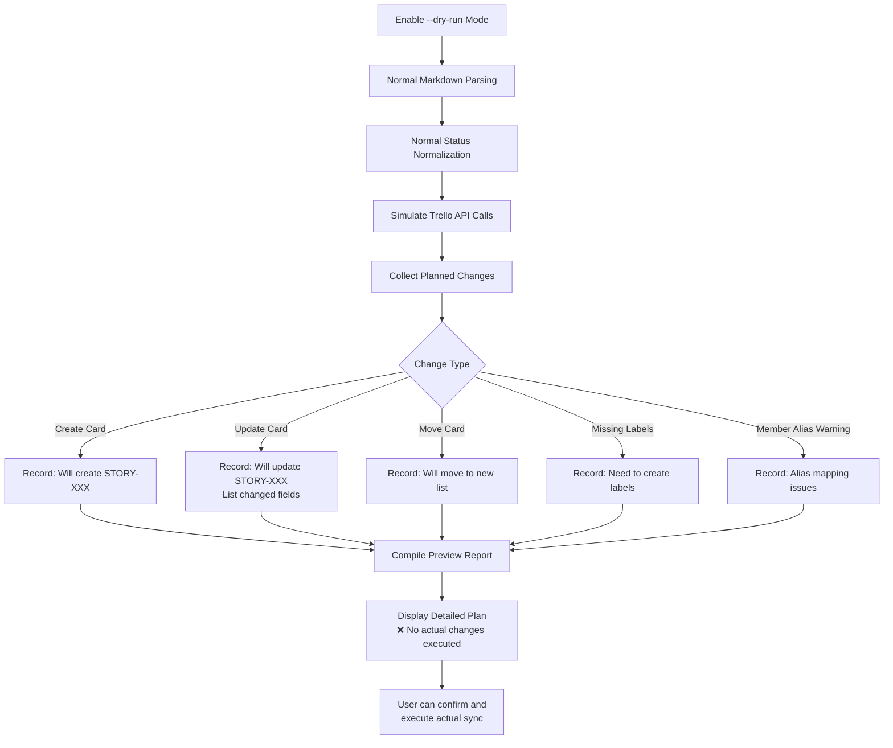

# Trello MD Sync - Workflow Diagrams

## 🔄 Core Workflow Overview



## 📥 Import Flow: Markdown → Trello



## 📤 Export Flow: Trello → Markdown



## 🔧 Configuration and Validation Flow



## 🎯 Story Data Model Transformation

```mermaid
graph LR
    subgraph "Markdown Format"
        A1[## Story: STORY-001 Title<br/>### Status<br/>Backlog<br/>### Description<br/>Feature description<br/>### Todo Items<br/>- [ ] Task 1<br/>- [x] Task 2]
    end
    
    subgraph "Story Object"
        B1[Story {<br/>  storyId: 'STORY-001'<br/>  title: 'Title'<br/>  status: 'backlog'<br/>  body: 'Feature description'<br/>  todos: [<br/>    {text: 'Task 1', done: false}<br/>    {text: 'Task 2', done: true}<br/>  ]<br/>  labels: []<br/>  assignees: []<br/>}]
    end
    
    subgraph "Trello Card"
        C1[Trello Card {<br/>  name: 'STORY-001: Title'<br/>  desc: 'Feature description'<br/>  list: 'Backlog'<br/>  checklists: [<br/>    {name: 'Tasks', items: [<br/>      {name: 'Task 1', state: 'incomplete'}<br/>      {name: 'Task 2', state: 'complete'}<br/>    ]}<br/>  ]<br/>}]
    end
    
    A1 -->|Parse| B1
    B1 -->|Render| A1
    B1 -->|Sync| C1
    C1 -->|Transform| B1
```

## 🚦 Error Handling and Recovery Flow



## 🔄 Dry Run Flow



This workflow diagram shows the complete working mechanism of Trello MD Sync, including bidirectional synchronization, error handling, configuration validation, and dry-run preview features. Each process is carefully designed to ensure data consistency and operation safety.